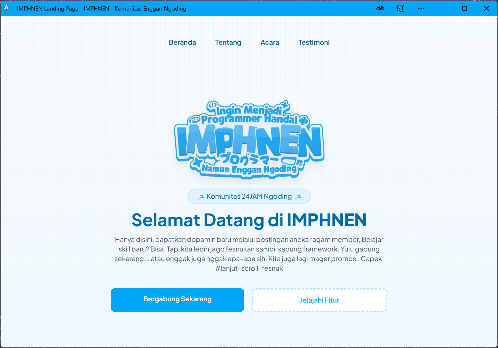

# 🚀 Next.js Landing Page Starter

A blazing-fast ⚡, modern 🧩, and developer-friendly 🛠️ starter template for building beautiful **landing pages** with **Next.js** pages router.

Save hours of repetitive setup! This template comes pre-configured with essential tools like **SEO**, **PWA**, **AOS**, **Framer Motion**, and more — so you can jump straight into building **awesome content**, not boilerplate.



---

## ✨ Why Use This Starter?

- ✅ **Modern Stack** — Built with [Next.js](https://nextjs.org/) and [Tailwind CSS](https://tailwindcss.com/) for fast, responsive UI development.
- 🎯 **SEO & PWA Ready** — Pre-configured with `next-seo` and `next-pwa` to ensure best practices and offline support from day one.
- 🎨 **Animations Out of the Box** — Smooth scroll effects via AOS and powerful animations via Framer Motion.
- ⚙️ **Instant Setup** — Skip tedious configurations like sitemap, metadata, theming, and start shipping fast.
- ☁️ **Deploy Instantly** — Optimized for one-click deployment with [Vercel](https://vercel.com/).

---

## 🚀 Getting Started

Create your project using the following command:

```bash
npx create-next-app -e https://github.com/dwiwijaya/nextjs-landing-starter
```

Then start the development server:

```bash
cd nextjs-landing-starter
npm install
npm run dev
```

Or clone this project using this following command:
 ```bash
git clone https://github.com/dwiwijaya/nextjs-landing-starter
```

Open your browser at [http://localhost:3000](http://localhost:3000) to see it in action.

---

## 🧰 What's Included?

Here’s a curated list of tools and libraries baked into this template:

| Tool | Purpose |
|------|---------|
| **AOS** | Animate elements on scroll |
| **Axios** | HTTP client for API requests |
| **Framer Motion** | Smooth component animations |
| **next-seo** | SEO optimization & Open Graph tags |
| **next-pwa** | Offline support & PWA integration |
| **next-themes** | Dark/light theme switching |
| **React Hook Form** | Flexible and performant form handling |
| **React Slick** | Beautiful and responsive carousels |
| **clsx** | Conditional class name utility |
| **nprogress** | Loading bar on page transitions |

---

## ⚡ Deployment

This project is fully optimized for **Vercel**. Just push your code to GitHub and import the repo to [vercel.com](https://vercel.com/) — done! 🚀

---

## 🤝 Contributing

Contributions are welcome!  
Feel free to [open an issue](https://github.com/dwiwijaya/nextjs-landing-starter/issues) or submit a pull request to improve this starter.

---

## 📄 License

Licensed under the [MIT License](LICENSE).

---

## 🌍 Live Preview

Check out the live version here:  
👉 [https://nextjs-landing-starter.vercel.app/](https://nextjs-landing-starter.vercel.app/)

---

Made with 💙 by [Dwi Wijaya](https://github.com/dwiwijaya)
